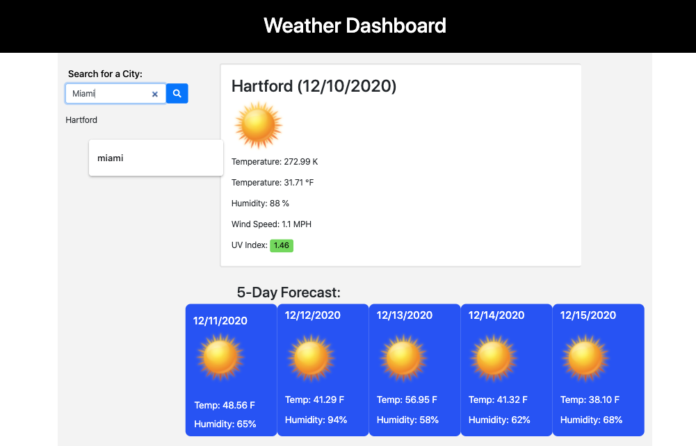

# Weather Dashboard

<span align="left">

<a href="https://img.shields.io/badge/License-MIT-brightgreen?style=plastic"></a>

 </span>
 
## Description

A weather dashboard application built from scratch that uses OpenWeather API. 

Developers are often tasked with retrieving data from another application's API and using it in the context of their own. Third-party APIs allow developers to access their data and functionality by making requests with specific parameters to a URL. 


## Technologies Used

- Third-Party APIs

## Goals
- Build a weather dashboard
- The application will run in the browser and feature dynamically updated HTML and CSS.
- Will utilize [OpenWeather API](https://openweathermap.org/api) to retrieve weather data for cities.
    - Refer to the above site's documentation that includes a section called "How to start" that will provide basic setup and usage instructions. 
- Use `localStorage` to store any persistent data.


## Instructions

Our instructions for this assignment were based on the following user story and acceptance criteria:

### User Story

```
AS A traveler
I WANT to see the weather outlook for multiple cities
SO THAT I can plan a trip accordingly
```

### Acceptance Criteria

```
GIVEN a weather dashboard with form inputs
WHEN I search for a city
THEN I am presented with current and future conditions for that city and that city is added to the search history
WHEN I view current weather conditions for that city
THEN I am presented with the city name, the date, an icon representation of weather conditions, the temperature, the humidity, the wind speed, and the UV index
WHEN I view the UV index
THEN I am presented with a color that indicates whether the conditions are favorable, moderate, or severe
WHEN I view future weather conditions for that city
THEN I am presented with a 5-day forecast that displays the date, an icon representation of weather conditions, the temperature, and the humidity
WHEN I click on a city in the search history
THEN I am again presented with current and future conditions for that city
WHEN I open the weather dashboard
THEN I am presented with the last searched city forecast
```

## Developer

For my weather dashboard I focused on adding more html via JavaScript. I tried to keep simplified html format, but as I progressed, it was clear that I wasn't ready to take that leap just yet. Hopefully next time!

P.S. Note to self: Always save changes and push commits before you walk away from your desk. You fixed it this time, but next time you may not be so lucky.

[Weather Dashboard](https://dsmooke.github.io/weather-dashboard/)

[GitHub Repo](https://github.com/dsmooke/weather-dashboard)


## Mock-Up

The following image demonstrates the application functionality:



## Installation

1. Clone repo and install packages.

## Contact

[Dana Smooke]("https://github.com/dsmooke")

** **Update: November 2020** Icons for weather do not change. Fix tbd. **

## License

[MIT]("https://opensource.org/licenses/MIT")

---

© 2021 Trilogy Education Services, LLC, a 2U, Inc. brand. Confidential and Proprietary. All Rights Reserved.


